Here is a comprehensive, professional **README.md** for your CI/CD pipeline. It includes a visual diagram of the flow, setup instructions, and explanations of the advanced features we built (like self-healing and caching).

You can place this file in `.github/workflows/README.md` or the root of your repository.

---

# 🚀 Terraform CI/CD Pipeline (Infrastructure + Application)

This repository uses **GitHub Actions** to automate the provisioning of AWS infrastructure (via Terraform) and the deployment of the IoT Simulator application (via Docker/ECS).

The pipeline is designed with a **"Build Once, Deploy Anywhere"** philosophy, split into two distinct environments:

- **🔵 DEV:** Rapid iteration. Deploys automatically on Pull Requests and commits to `dev`.
- **🔴 PROD:** Stable release. Deploys only when code is merged into `main`.

---

## 📊 Pipeline Architecture

The following diagram illustrates the flow of the CI/CD pipeline:

```mermaid
graph TD
    %% Triggers
    TriggerDev[Push/PR to 'dev'] --> CI
    TriggerProd[Push to 'main'] --> CI

    %% Stage 1: Continuous Integration
    subgraph "Stage 1: CI"
        CI[Terraform Fmt & Validate]
    end

    %% Flow Split
    CI -->|Branch = dev| PlanDev
    CI -->|Branch = main| PlanProd

    %% Stage 2: Infrastructure (Dev)
    subgraph "Stage 2: Infrastructure (DEV)"
        PlanDev[📝 Plan DEV] --> ApplyDev[🏗️ Apply DEV]
        ApplyDev -->|Self-Healing| SmartImportDev[🛡️ Smart Import]
    end

    %% Stage 3: Application (Dev)
    subgraph "Stage 3: Application (DEV)"
        ApplyDev --> BuildDev[🐳 Build & Push Image]
        BuildDev -->|Cache Hit| DeployDev[🚀 Force ECS Update]
        DeployDev --> HealthDev[⏳ Wait for IP]
        HealthDev --> DashDev[📝 Generate Dashboard]
    end

    %% Stage 2: Infrastructure (Prod)
    subgraph "Stage 2: Infrastructure (PROD)"
        PlanProd[📝 Plan PROD] --> ApplyProd[🏗️ Apply PROD]
        ApplyProd -->|Self-Healing| SmartImportProd[🛡️ Smart Import]
    end

    %% Stage 3: Application (Prod)
    subgraph "Stage 3: Application (PROD)"
        ApplyProd --> BuildProd[🐳 Build & Push Image]
        BuildProd -->|Cache Hit| DeployProd[🚀 Force ECS Update]
        DeployProd --> HealthProd[⏳ Wait for IP]
        HealthProd --> DashProd[📝 Generate Dashboard]
    end

```

---

## ✨ Key Features

1. **🛡️ Self-Healing Infrastructure**

- Uses a custom `tf-smart-import.sh` script.
- Automatically detects "Zombie Resources" (resources that exist in AWS but are missing from Terraform State) and imports them before applying.
- Prevents `EntityAlreadyExists` errors.

2. **⚡ Docker Caching**

- Uses GitHub Actions Cache (`type=gha`) for Docker builds.
- drastically reduces build times by reusing layers from previous runs.

3. **👁️ Verbose Deployment Dashboard**

- Generates a live summary at the end of every run.
- Displays **Direct Access Links** (App, Grafana, Prometheus).
- Shows technical metadata: Commit SHA, Docker Tags, Cluster Name, and Task Public IP.

4. **🔄 Reliability Loops**

- The "Fetch IP" step includes a smart retry loop.
- It waits up to **5 minutes** for the ECS Task to reach `RUNNING` state before giving up, ensuring the dashboard links are always valid.

---

## ⚙️ Prerequisites & Setup

### 1. AWS OpenID Connect (OIDC)

This pipeline uses OIDC for passwordless authentication with AWS.

- **Role ARN:** stored in `AWS_ROLE_ARN_CP`.

### 2. GitHub Secrets

Ensure the following secrets are added to your repository settings:

| Secret Name                 | Description                                     |
| --------------------------- | ----------------------------------------------- |
| `AWS_ROLE_ARN_CP`           | The IAM Role ARN for GitHub Actions OIDC.       |
| `GRAFANA_SMTP_USER`         | SMTP Username for Grafana email alerts.         |
| `GRAFANA_SMTP_PASSWORD`     | SMTP Password for Grafana email alerts.         |
| `TF_VAR_cert_base64_root`   | Base64 encoded AWS Root CA certificate.         |
| `TF_VAR_cert_base64_device` | Base64 encoded IoT Device Certificate (`.crt`). |
| `TF_VAR_cert_base64_key`    | Base64 encoded IoT Private Key (`.key`).        |

### 3. Terraform Backend

The pipeline expects the following resources to exist (created via the `ensure-resources.sh` script):

- **S3 Buckets:** `grp1-ce11-dev-iot-tfstate`, `grp1-ce11-prod-iot-tfstate`
- **DynamoDB Tables:** `grp1-ce11-dev-iot-locks`, `grp1-ce11-prod-iot-locks`

---

## 🛠️ Workflow Steps Explained

### 1. Terraform CI (`terraform-ci`)

- Runs `terraform fmt -check` to ensure code style.
- Runs `terraform validate` on both Dev and Prod folders to catch syntax errors early.

### 2. Plan (`plan-dev` / `plan-prod`)

- Injects IoT certificates from secrets into files.
- Initializes Terraform.
- Generates a plan to show what changes will be made to AWS.

### 3. Apply (`apply-dev` / `apply-prod`)

- **Smart Import:** Checks for existing IAM/S3/Log resources and imports them if needed.
- **Apply:** Executes the changes.
- **Artifacts:** Saves output variables (ECR URL, Cluster Name) to a file `deploy.env` for the next job.

### 4. Deploy (`deploy-dev` / `deploy-prod`)

- **Build:** Builds the Docker image for the IoT Simulator.
- **Push:** Pushes the image to Amazon ECR.
- **Update:** Forces a new deployment in ECS (`--force-new-deployment`).
- **Wait:** Loops for 30s-300s waiting for the task to provide a Public IP.
- **Dashboard:** Writes the final status table to the GitHub Summary.

---

## 🐛 Troubleshooting

| Issue                              | Cause                                          | Fix                                                                                                                          |
| ---------------------------------- | ---------------------------------------------- | ---------------------------------------------------------------------------------------------------------------------------- |
| **"EntityAlreadyExists"**          | Resource exists in AWS but not in State.       | The pipeline now fixes this automatically via `tf-smart-import.sh`. If it persists, run `terraform import` manually locally. |
| **"Error acquiring state lock"**   | A previous run crashed or is still running.    | Go to DynamoDB -> `locks` table -> Delete the item with the LockID.                                                          |
| **"IP Not Found" in Dashboard**    | The ECS Task took longer than 5 mins to start. | Check ECS Console for errors (e.g., ImagePullBackOff, HealthCheck failure).                                                  |
| **"ResourceInUse" (Target Group)** | Listener is holding the TG lock.               | Run the local cleanup script to delete Listeners manually, then re-run pipeline.                                             |
